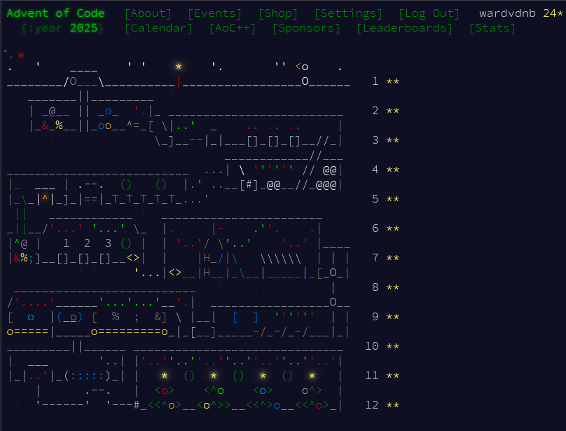

# Advent Of Code 2025 Solutions

My solutions for [Advent of Code](https://adventofcode.com/) 2025, using Python as programming language.  
- These were written without AI assistance, and the goal was simply to solve 
the puzzles. 
- The solutions were not to optimized for performance or code style.
- Some solutions I couldn't find by myself, for multiple puzzles I had to watch other people's solutions or watch a visualisation of the solution.
- Puzzle descriptions and inputs are omitted to respect the creator's wishes.

